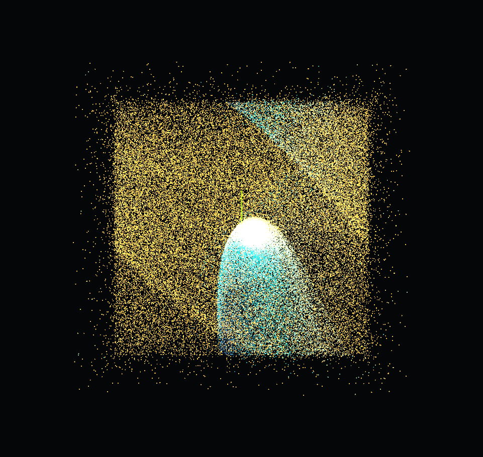

# Evidencia de emergencia: combo "cometa"

Captura de pantalla directa del canvas (961x910, sin panel UI), producida corriendo el sistema en un estado extremo para probar robustez (ver `registro-pruebas.md`, prueba de estres). Nadie dibujo esta forma. No existe ningun codigo que dibuje colas, cabezas brillantes ni curvas, el render solo lee `positionBuffer` y colorea por velocidad (`createSimulation.js:101-112`). La forma es consecuencia exclusiva de combinar radial + vortice + viento en magnitud extrema, mas la integracion Euler semiimplicita acumulando 131,072 trayectorias independientes en paralelo.

## Secuencia exacta (reproducible)

Las posiciones iniciales usan `hash()` sembrado por indice de particula, no aleatoriedad real dependiente del tiempo, asi que esta secuencia reproduce la misma forma de forma confiable desde un Reset limpio:

1. Reset
2. Viento ON (`2`)
3. `Num +` x25 (timeScale al maximo, 2.0)
4. `Num 8` x30 (radialStrength al maximo, 8.0)
5. `Num *` x60 (drag al maximo, 1.0)
6. 80 pulsaciones alternadas de `1`/`2`/`3`/`Num 0` en secuencia
7. Espacio mantenido/soltado 20 veces seguidas, sin pausa entre bajar y soltar

Estado final: Radial ON, Vortice ON, Drag OFF, Viento ON, radialStrength=8.0, timeScale=2.0.

## Por que cuenta como emergencia, no decoracion

- La cabeza brillante blanca/cian es la zona de mayor densidad y velocidad (satura el extremo calido... en este caso el extremo cian del gradiente por sobreexposicion aditiva), no un sprite especial.
- La cola dorada dispersa es simplemente el resto de las 131,072 particulas en distintos estados de velocidad segun cuanto tiempo llevan bajo la influencia combinada de las tres fuerzas.
- El arco curvado visible en la esquina superior es el componente tangencial del vortice actuando sobre particulas que el viento ya habia desplazado en +X, nunca se calculo ni dibujo una curva directamente.
- Verificado sin errores de consola durante toda la secuencia (`registro-pruebas.md`, prueba de estres general).

Relevante para el criterio de rubrica "Diseño de fuerzas e intención" (20%): el comportamiento emerge de condiciones dinamicas, no esta dibujado. Esta imagen es evidencia visual concreta y reproducible de eso, aunque la combinacion especifica (todo al extremo) no forma parte de la interpretacion final planeada, es prueba de que el sistema en si produce formas no anticipadas a partir de fuerzas ya comprendidas y verificadas por separado.
